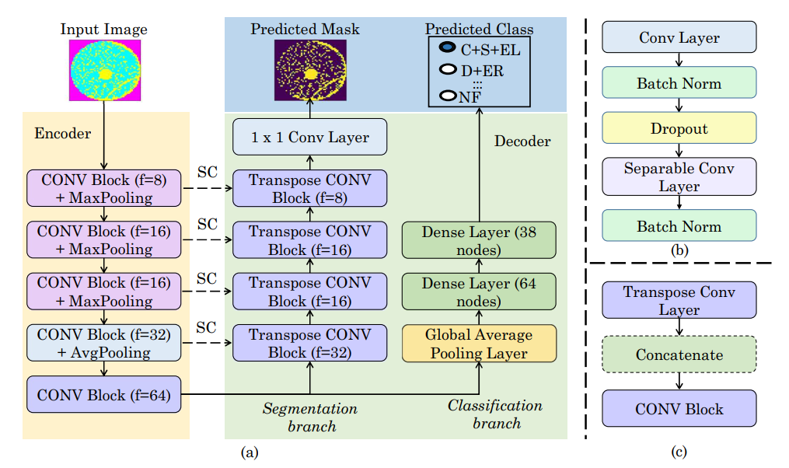

WaferSegClassNet - A Light-weight Network for Classification and Segmentation of Semiconductor Wafer Defects
==============================

This repository contains the source code of our paper, WaferSegClassNet (accepted for publication in <a href="https://www.sciencedirect.com/journal/computers-in-industry">Computers in Industry</a>).

we propose WaferSegClassNet (WSCN), a deep-learning model for simultaneously performing both classification and segmentation of defects on Wafer Maps. To the best of our knowledge, WSCN is the first wafer defect analysis model that performs both segmentation and classification. WSCN follows a multi-task learning framework to segment and classify an image simultaneously. 




## Sample Results
<hr>

Check our <a href="check.com">project</a> page for more qualitative results.

<p align="center"></p>

Project Organization
------------

    ├── LICENSE
    ├── README.md          <- The top-level README for developers using this project.
    ├── data
    │   ├── processed      <- The final, canonical data sets for modeling.
    │   └── raw            <- The original, immutable data dump.
    ├── notebooks          <- Jupyter notebooks. Naming convention is a number (for ordering),
    │
    ├── requirements.txt   <- The requirements file for reproducing the analysis environment.
    │
    ├── src                <- Source code for use in this project.
    │   ├── __init__.py    <- Makes src a Python module
    │   ├── config.py      <- All configuration params
    |   ├── util.py        <- All utilities functions
    │   │
    │   ├── data           <- Script to generate data in required format
    │   │   └── make_dataset.py
    │   │
    │   ├── models         <- Scripts to train models and then use trained models to make
    │   │   │                 predictions and test performance.
    │   │   ├── predict_model.py
    │   │   └── train_model.py
    |   |   └── test_model.py
    |   |   └── network.py
    |   |   └── loss.py
    ├── inference          <- Inference directory, where predicted masks are stored.
    ├── logs               <- Logs directory for saving terminal output.
    ├── weights            <- Weights directory for saving checkpoints.
--------

## Get Started
<hr>
Dependencies:

```
pip install -r requirements.txt
```

## (Optional) Conda Environment Configuration

First, create a conda environment
```bash
conda create -n wscn # python=3
source activate wscn
```

Now, add dependencies

Now, you can install the required packages.
```bash
pip install -r requirements.txt
```

## Dataset
